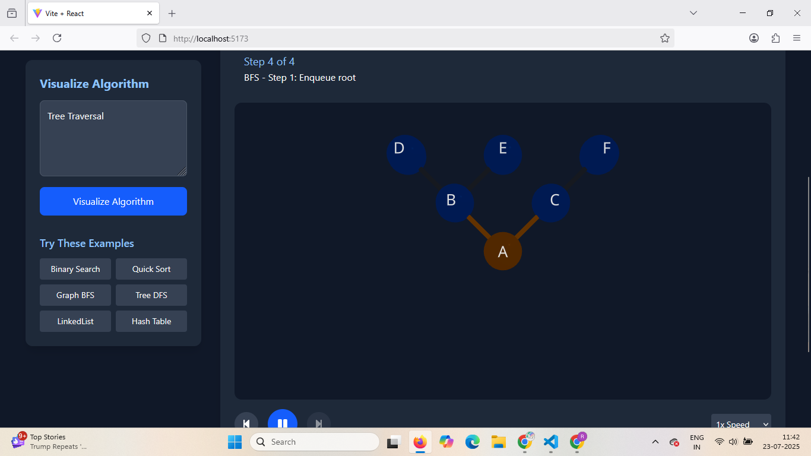

# AI Algorithm Visualization

![Project Screenshot]



An interactive algorithm visualizer powered by Gemini AI that transforms complex algorithms into intuitive 3D visualizations using React Three Fiber.

## Features

- 🎨 **Interactive 3D Visualizations** for various data structures:
  - Arrays with pointer tracking
  - Trees with traversal highlighting
  - Graphs with node/edge animations
  - Linked lists with pointer movements
  - Hash tables with bucket visualization
  - Recursion with stack frame visualization

- 🤖 **AI-Powered** using Gemini API to generate visualizations from algorithm descriptions
- ⏯️ **Step-by-Step Animation** with play/pause controls and adjustable speed
- 📚 **Multiple Views**: Visualization, pseudocode, and description tabs
- 🕒 **History Tracking** of previously visualized algorithms
- 🖥️ **Fullscreen Mode** for better viewing experience

## Live Demo

[Try it out here!](https://rohan1786.github.io/AI-Algorithm-Visualization/) <!-- Update with your actual deployment link -->

## Installation

1. Clone the repository:
   ```bash
   git clone https://github.com/Rohan1786/AI-Algorithm-Visualization.git